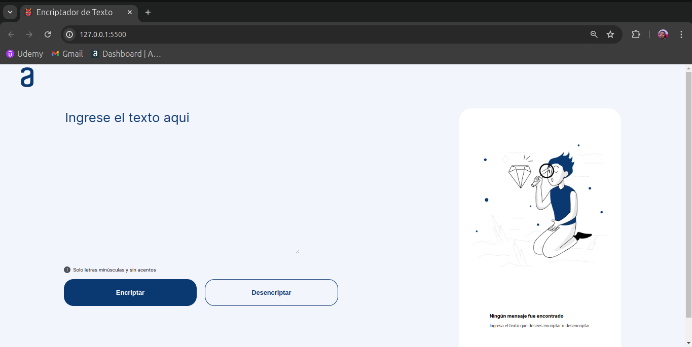

# Encriptador de Textos

Encriptador de Textos!!!

## Descripción

Esta es una aplicación web que permite encriptar y desencriptar textos según un conjunto específico de reglas. Es ideal para intercambiar mensajes secretos con otras personas que conozcan el método de encriptación utilizado.

Este proyecto es parte del curso de Alura Latam en colaboración con Oracle.

## Llaves de Encriptación

Las llaves de encriptación utilizadas son las siguientes:

- La letra "e" se convierte en "enter"
- La letra "i" se convierte en "imes"
- La letra "a" se convierte en "ai"
- La letra "o" se convierte en "ober"
- La letra "u" se convierte en "ufat"

## Requisitos

1. Funciona solo con letras minúsculas.
2. No se deben utilizar letras con acentos ni caracteres especiales.
3. Es posible convertir una palabra a su versión encriptada y devolver una palabra encriptada a su versión original.

Ejemplos:
- "gato" se convierte en "gaitober".
- "gaitober" se convierte en "gato".

## Funcionalidades

- Campo de entrada para insertar el texto que será encriptado o desencriptado.
- Opción para escoger entre encriptar o desencriptar el texto.
- Visualización del resultado en la pantalla.

## Extras

- Botón para copiar el texto encriptado/desencriptado al portapapeles, similar a la funcionalidad de "Ctrl+C" o la opción "copiar" en los menús de las aplicaciones.

## Cómo usar

1. Clona este repositorio en tu máquina local.
2. Abre el archivo `index.html` en tu navegador.
3. Introduce el texto que deseas encriptar o desencriptar en el campo correspondiente.
4. Selecciona la opción deseada (encriptar o desencriptar).
5. Haz clic en el botón para ver el resultado.
6. Usa el botón de copiar para transferir el texto resultante al portapapeles.

## Tecnologías Utilizadas

- HTML
- CSS
- JavaScript

## Autor

[@Efrasss](https://github.com/efrasss?tab=repositories)

## Licencia

Este proyecto está bajo la Licencia MIT. Para más detalles, consulta el archivo `LICENSE`.
